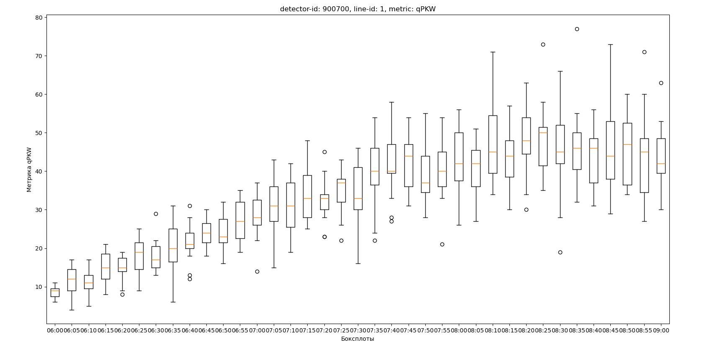
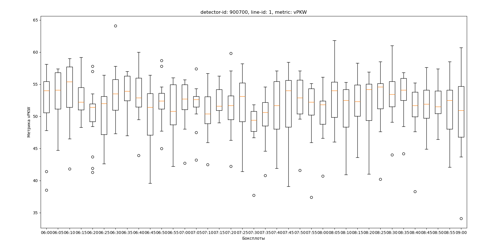
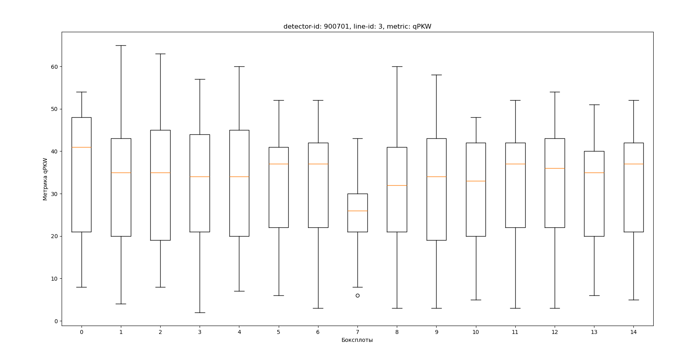
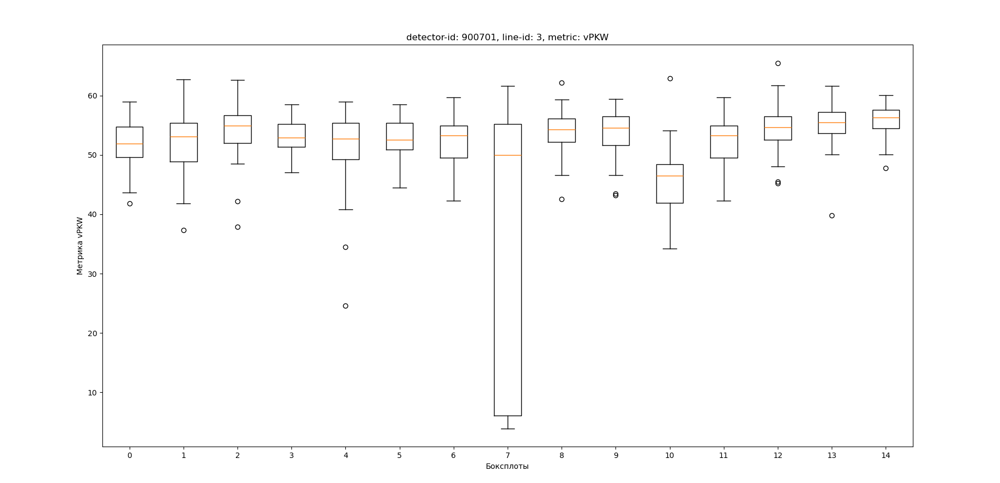

# Обработка данных

## Постановка задачи

### Входные данные

- Имеется 9 .xlsx таблиц, содержащих записи с дорожных детекторов.
- Записи содержат некоторую статистику, размеченную по времени.
- Пример: количество машин на дороге в течение n минут, средняя скорость в течение этих же n минут

### Выходные данные
- Нужно: отфильтровать, провалидировать данные, добавить недостающие записи.
- Сформировать и данные в формате, удобном для дальнейшего анализа и обработки (напр. построение графиков).

### Программная реализация
- python
- pandas
- numpy

### Результаты 

